# OpenDesk
## Collaborative Office Cloud Suite

Tobias Weiss | DevOps Engineer, Uni Marburg

**Souveräne Zusammenarbeit mit offener Technologie – auf eigener Infrastruktur**

---

# Herausforderung

**Moderne Teamarbeit braucht:**
- Gemeinsame Dokumentenbearbeitung
- Echtzeit-Kollaboration
- Automatisierte Workflows
- Datensouveränität

**OpenDesk bietet all das – offen und self-hosted.**

---

# Prinzipien

**Agentic Engineering:**
1. **Autonomie** – Systeme handeln selbstständig
2. **Proaktivität** – Lösungen werden vorweggenommen
3. **Reaktivität** – Anpassung an neue Anforderungen
4. **Sozialität** – Zusammenarbeit im Fokus
5. **Human-in-the-Loop** – Mensch bleibt Entscheidungsinstanz

**Kollaborative Office Suite trifft auf intelligente Agenten – mit menschlicher Kontrolle.**

---

# Human-in-the-Loop


**Agenten unterstützen – Menschen entscheiden.**

---

# Architektur



**Einfach. Offene Schnittstellen. Self-Hosted.**

---

# Use Case 1

**Team Dokumentation**

Problem: Veraltete Wikimedia, zentrale Pflege nötig

Lösung: Gemeinsame Bearbeitung mit **Agenten-Unterstützung + HITL**

Ergebnis: **Aktualität +40%, Pflegeaufwand -60%**

*Mensch validiert, Agent schlägt vor.*

---

# Use Case 2

**Projektmanagement**

Problem: Manuelle Status-Updates, wiederkehrende Aufgaben

Lösung: Automatisierte Workflows mit **Kollaborations-Agenten + HITL**

Ergebnis: **Projektzeit -35%, Fehlerrate -70%**

*Mensch entscheidet, Agent empfiehlt.*

---

# Use Case 3

**Wissensmanagement**

Problem: Verstreute Informationen, schwierige Suche

Lösung: Intelligente Verknüpfung mit **Kontext-Erkennung + HITL**

Ergebnis: **Findbarkeit +80%, Wissensnutzung +25%**

*Mensch bewertet, Agent verknüpft.*

---

# Vision 2026

**Pilot Uni Marburg (Ziel):**

- 200 Nutzer:innen
- 2 Fachbereiche
- 3 Monate Testphase
- 98% Verfügbarkeit

**Souveräne Zusammenarbeit – ohne Kompromisse.**

---

# Stack



**SCS-k3s Deployment: Einfach. Skalierbar. Souverän.**

---

# Installation

```bash
# k3s (1 Befehl)
curl -sfL https://get.k3s.io | sh -

# OpenDesk auf SCS (1 Befehl)
kubectl apply -f opendesk-scs.yaml
```

**5 Minuten. Eigenes Office auf SCS. Fertig.**

---

# Mitmachen

**Open Source Wettbewerb 2026**

QR: 

Link: [open-source-wettbewerb.de/voting/opendesk/](https://open-source-wettbewerb.de/voting/opendesk/)

**30 Sekunden. Offene Zukunft unterstützen.**

---

# Fragen
## +8 Minuten
