<!-- Slide 1 - 0:00-0:30 -->

# OpenDesk Edu

## Agentic Engineering in der Praxis

**Tobias Weiss**

tobias-weiss.org | opendesk-edu.org

*Im Anschluss an Christian Uhl – "Agentic AI in der Praxis"*

HackyHour Gießen · 26.08.2026 · 12+8 Format

---

<!-- Slide 2 - 0:30-1:30 -->

# Das Konzept

## Einfach. Mächtig. Offen.

**Kubernetes-basierte Agenten-Plattform für Bildung**

- **Einfach:** Jeder Agent hat eine Aufgabe – UNIX-Prinzip
- **Mächtig:** Zusammen lösen sie komplexe Probleme
- **Offen:** 100% Open Source, Self-Hosted, DSGVO-konform

"Do one thing and do it well."

---

<!-- Slide 3 - 1:30-2:30 -->

# Die Architektur

**Ein System. Vier Agenten. Maximale Flexibilität.**

---

<!-- Slide 4 - 2:30-3:00 -->

# Kubernetes-Infrastruktur

**Skalierbar. Robust. Self-Hosted.**

---

<!-- Slide 5 - 3:00-4:00 -->

# Die vier Agenten

**Jeder Agent – eine klare Aufgabe:**

- **User Agent:** Fortschritt tracken, Blockaden erkennen, next steps empfehlen
- **Knowledge Agent:** Inhalte strukturieren, Zusammenhänge herstellen, Fragen beantworten
- **Feedback Agent:** Abgaben analysieren, Vorschläge generieren – **Mensch entscheidet final**
- **Collaboration Agent:** Echtzeit-Übersetzung, Projekte organisieren, Mentoren vermitteln

---

<!-- Slide 6 - 4:00-4:30 -->

# Das Problem

### Dozent
150 Abgaben × 4 Minuten = **10 Stunden pro Woche** manueller Aufwand

### Lernender
3 Stunden Frust bei Konzepten, die in 30 Minuten verständlich sein könnten

### Forschungsteam
4 Monate Koordination statt 2 Wochen Analyse bei internationalen Teams

Das muss nicht sein.

---

<!-- Slide 7 - 4:30-6:00 -->

# Use Case 1: Korrektur-Unterstützung

**Ablauf:** Feedback Agent analysiert Abgaben → erkennt Muster → generiert Vorschläge → **Dozent behält finale Kontrolle**

**Potenzial:** Deutliche Zeitersparnis bei der Korrektur – **der Mensch entscheidet immer final.**

---

<!-- Slide 8 - 6:00-7:30 -->

# Use Case 2: Adaptives Lernen

**Ablauf:** User Agent erkennt Blockade → Knowledge Agent findet alternative Erklärungen → Collaboration Agent vermittelt Mentor → Feedback Agent generiert Übungen

**Potenzial:** Deutlich schnelleres Verständnis durch personalisierte Lernpfade.

---

<!-- Slide 9 - 7:30-8:30 -->

# Use Case 3: Kollaborative Forschung

**Ablauf:** Knowledge Agent strukturiert Daten → Collaboration Agent übersetzt in Echtzeit → Feedback Agent validiert Qualität

**Potenzial:** Massiv beschleunigte Projektabwicklung – internationale Teams ohne Barrieren.

---

<!-- Slide 10 - 8:30-9:00 -->

# Technologie-Stack

**Small, sharp tools. UNIX-Prinzip.**

---

<!-- Slide 11 - 9:00-10:00 -->

# Kubernetes: Skalierbar & Robust

**Microservices-Architektur:**
- Jeder Agent als separater Service – unabhängig skalierbar
- Auto-Scaling basierend auf Last
- Self-Healing (automatischer Neustart bei Fehlern)
- Rolling Updates ohne Downtime
- Load Balancing über alle Worker Nodes

**Enterprise-Ready:**
- Helm Charts für Deployment
- Terraform für Infrastructure as Code
- Von 10 bis 10.000 Nutzern skalierbar
- Volle Datenkontrolle durch Self-Hosting

---

<!-- Slide 12 - 10:00-11:00 -->

# Mitmachen

**Schnellstart (5 Minuten):**

`docker compose up -d`

**Oder mit Kubernetes:**

`kubectl apply -f manifests/`

**Ressourcen:**
GitHub: github.com/opendesk-edu
Website: opendesk-edu.org

**Open Source · Self-Hosted · DSGVO-konform**

---

<!-- Slide 13 - 11:00-12:00 -->

# 🗳️ Jetzt abstimmen

## Open Source Wettbewerb 2026

**Jede Stimme zählt.**

[open-source-wettbewerb.de/voting/opendesk-edu](https://open-source-wettbewerb.de/voting/opendesk-edu/)

30 Sekunden Ihrer Zeit – ein großer Unterschied.

---

<!-- Q&A Slide -->

# Fragen & Diskussion

## +8 Minuten

**Technisch:** Kubernetes, Skalierbarkeit, Modell-Integration, API

**Rechtlich:** EU AI Act, DSGVO, assisted vs. automated

**Philosophisch:** UNIX-Prinzip, Agentic Engineering, Minimalismus

**Praktisch:** Installation, Community, Roadmap

Vielen Dank für Ihre Aufmerksamkeit.

