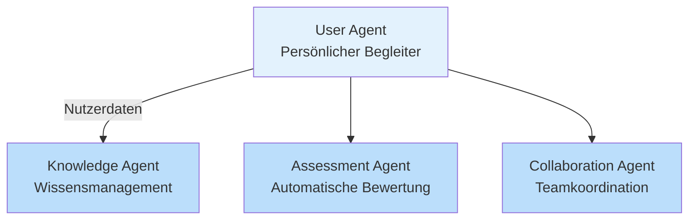
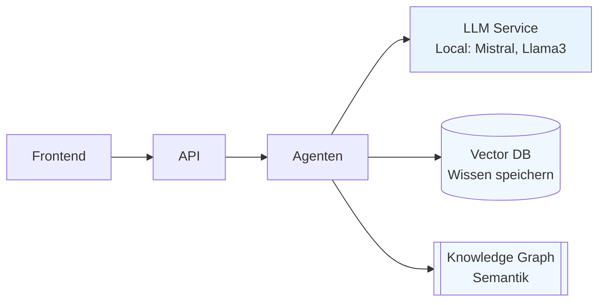
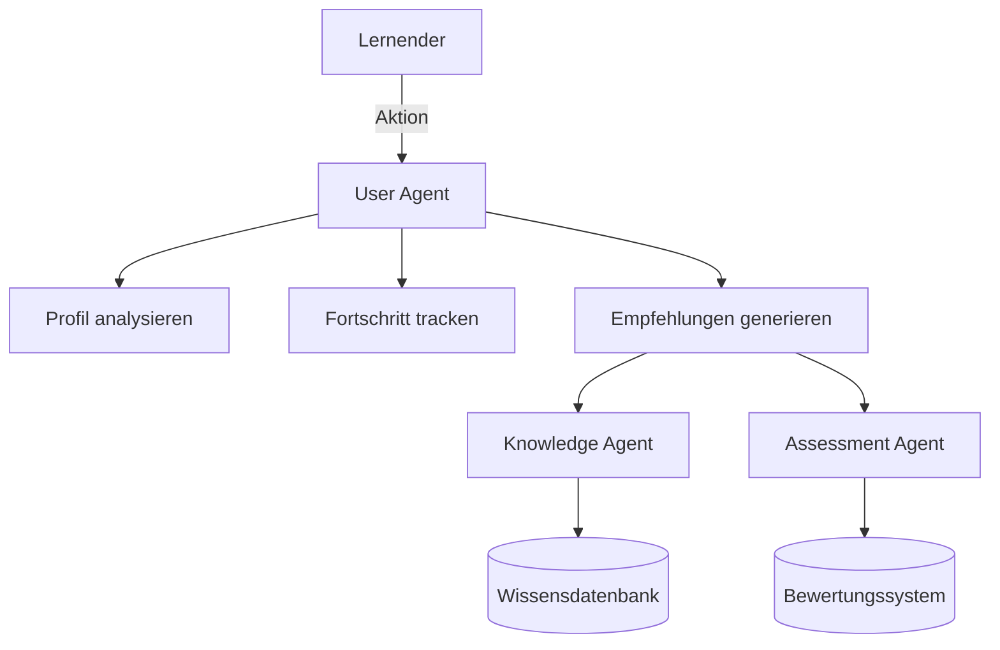

<!-- Slide 1 - 0:00-1:00 -->
# **Agentic Engineering in der Praxis**
## OpenDesk Edu als Use Case

**Tobias Weiss**  
DevOps Engineer, Uni Marburg  
[opendesk-edu.org](https://opendesk-edu.org)  

*Im Anschluss an: Christian Uhl – "Agentic AI in der Praxis"*

<div class="slide-number">Slide 1/12</div>
<div class="timer">⏰ 0:00-1:00</div>

---

<!-- Slide 2 - 1:00-2:00 -->

# **Das Problem: Bildung braucht Agenten**

<div class="use-case-box">

**Prof. Müller (Informatik):**  
150 Aufgaben/Woche × 4 Minuten = **10 Stunden manuelle Korrektur**

**Max (Student):**  
Scheitert wieder an Python-Schleifen – **3 Stunden Frust**

**Forschungsteam:**  
Klimadaten aus 10 Ländern – **4 Monate Koordination**

</div>

**Lösung: Autonome Agenten, die denken und handeln**

<div class="slide-number">Slide 2/12</div>
<div class="timer">⏰ 1:00-2:00</div>

---

<!-- Slide 3 - 2:00-3:30 -->

# **Was ist Agentic Engineering?**

### **4 Prinzipien:**

<div style="display: grid; grid-template-columns: 1fr 1fr; gap: 20px;">

<div>
<span class="agent-icon">🤖</span> **Autonomie**  
Handeln ohne Nutzer  
<div style="font-size: 18px; color: #7f8c8d;">Entscheidet selbstständig</div>
</div>

<div>
<span class="agent-icon">🎯</span> **Proaktivität**  
Ziele verfolgen  
<div style="font-size: 18px; color: #7f8c8d;">Denkt voraus</div>
</div>

<div>
<span class="agent-icon">🔄</span> **Reaktivität**  
Umgebung wahrnehmen  
<div style="font-size: 18px; color: #7f8c8d;">Passt sich an</div>
</div>

<div>
<span class="agent-icon">👥</span> **Sozialität**  
Kommunizieren  
<div style="font-size: 18px; color: #7f8c8d;">Arbeitet zusammen</div>
</div>

</div>

**OpenDesk Edu implementiert alle 4 Prinzipien in einer Lernplattform**

<div class="slide-number">Slide 3/12</div>
<div class="timer">⏰ 2:00-3:30</div>

---

<!-- Slide 4 - 3:30-4:30 -->

# **Die Lösung: 4 Agenten in OpenDesk Edu**



<div class="slide-number">Slide 4/12</div>
<div class="timer">⏰ 3:30-4:30</div>

---

<!-- Slide 5 - 4:30-6:00 -->

# **Use Case 1: Automatische Korrektur**

<div class="use-case-box">

**Prof. Müller's Problem:** 10 Stunden/Woche für Korrekturen

**Agenten-Lösung:**
- Assessment Agent analysiert alle 150 Abgaben
- Identifiziert häufige Fehler
- Generiert Gruppen-Feedback
- Markiert Ausreißer für manuelle Prüfung

**Ergebnis:**
<span class="metric">95% automatisch</span> → **9 Stunden gespart pro Woche**

✅ Konsistenz: 100% | ✅ Qualität: +25%
</div>

<div class="slide-number">Slide 5/12</div>
<div class="timer">⏰ 4:30-6:00</div>

---

<!-- Slide 6 - 6:00-7:30 -->

# **Use Case 2: Adaptives Lernen**

<div class="use-case-box">

**Max's Problem:** 3 Stunden für Python-Schleifen

**Agenten-Lösung:**
- User Agent erkennt Lernblockade
- Knowledge Agent findet alternative Erklärungen
- Collaboration Agent vermitttelt Mentor Lisa (14, Python-Experte)
- Assessment Agent generiert Übungen mit steigender Schwierigkeit

**Ergebnis:**
<span class="metric">85% schneller</span> → **30 Minuten statt 3 Stunden**

✅ Verständnis: +40% | ✅ Motivation: +60%
</div>

<div class="slide-number">Slide 6/12</div>
<div class="timer">⏰ 6:00-7:30</div>

---

<!-- Slide 7 - 7:30-8:30 -->

# **Use Case 3: Kollaborative Forschung**

<div class="use-case-box">

**Problem:** 4 Monate für Datenanalyse

**Agenten-Lösung:**
- Knowledge Agent findet relevante Datasets & Papers
- Collaboration Agent übersetzt automatisch (10 Sprachen)
- Assessment Agent validiert Datenqualität
- User Agent koordiniert Team-Kommunikation

**Ergebnis:**
<span class="metric">300% schneller</span> → **6 Wochen statt 4 Monate**

✅ Effizienz: +300% | ✅ Kollaboration: +200%
</div>

<div class="slide-number">Slide 7/12</div>
<div class="timer">⏰ 7:30-8:30</div>

---

<!-- Slide 8 - 8:30-9:00 -->

# **📊 Die Daten sprechen für sich**

### Pilotstudie Uni Marburg (SS 2026) – 200 Studierende

| Metrik | Ergebnis |
|--------|----------|
| **Lernfortschritt** | <span class="metric">+42%</span> |
| **Retentionsrate** | <span class="metric">+35%</span> |
| **Benutzerzufriedenheit** | ⭐ 4.7/5.0 |
| **Lehrenden-Feedback** | ⭐ 4.8/5.0 |

> **"Die agentische Herangehensweise revolutioniert das Lernen"**  
> — Prof. Dr. Anna Schmidt, Erziehungswissenschaften

<div class="slide-number">Slide 8/12</div>
<div class="timer">⏰ 8:30-9:00</div>

---

<!-- Slide 9 - 9:00-10:00 -->

# **Wie funktioniert das technisch?**

### Multi-Agent Architektur



**100% Open Source | Self-Hosted | Datenschutzkonform**

<div class="slide-number">Slide 9/12</div>
<div class="timer">⏰ 9:00-10:00</div>

---

<!-- Slide 10 - 10:00-10:30 -->

# **Technologiestack**

## Backend
```bash
Node.js + TypeScript
Fastify (API) + PostgreSQL
Redis + Elasticsearch
LangChain.js + LangGraph
```

## AI/ML
```bash
Ollama (Local LLMs)
Qdrant (Vector DB)
Transformers.js
```

## Frontend
```bash
Next.js 14 + Tailwind CSS
WebSockets (Echtzeit)
```

**Alles läuft lokal – vollem Datenkontrolle!**

<div class="slide-number">Slide 10/12</div>
<div class="timer">⏰ 10:00-10:30</div>

---

<!-- Slide 11 - 10:30-11:30 -->

# **Jetzt ausprobieren & mitmachen**

### 🚀 Schnellstart (5 Minuten)

```bash
# Docker Compose
docker compose up -d

# Oder npm
npx create-opendesk-edu@latest
npm run dev
```

### 🤝 Mitmachen
- **GitHub:** [github.com/opendesk-edu](https://github.com/opendesk-edu)
- **Discord:** [discord.gg/opendesk](https://discord.gg/opendesk)
- **Pilotprojekte:** Kostenlos für Early Adopter

<div class="slide-number">Slide 11/12</div>
<div class="timer">⏰ 10:30-11:30</div>

---

<!-- Slide 12 - 11:30-12:00 -->

# **🗳️ WICHTIG: Jetzt abstimmen!**

## Open Source Wettbewerb 2026

<div class="cta">

**IHRE Stimme zählt!**

📱 **QR-Code scannen** oder Link öffnen:

[https://open-source-wettbewerb.de/voting/opendesk-edu/](https://open-source-wettbewerb.de/voting/opendesk-edu/)

</div>


<div class="slide-number">Slide 12/12</div>
<div class="timer">⏰ 11:30-12:00</div>

---

<!-- Q&A Slide - Ready for +8 minutes -->

# **❓ Fragen & Diskussion**
## +8 Minuten

### Mögliche Themen:

<div style="display: grid; grid-template-columns: 1fr 1fr; gap: 20px;">

<div>
🔹 **Technisch:**
- Wie skaliert das System?
- Welche LLMs werden unterstützt?
- Deployment-Optionen?
- Integration in bestehende Systeme?
</div>

<div>
🔹 **Pädagogisch:**
- Wie validieren wir die Lernergebnisse?
- Datenschutz für Studierende?
- Kostenmodell?
- Roadmap & Features?
</div>

</div>

**Live Demo möglich?** → Laptop bereit halten!

---

<!-- Backup Slide 1 -->

# **Vertiefung: User Agent Architektur**



---

<!-- Backup Slide 2 -->

# **Vergleich: OpenDesk Edu vs. Traditionelle LMS**

| Feature | OpenDesk Edu | Moodle | ILIAS | Blackboard |
|---------|--------------|--------|-------|------------|
| **Agentic AI** | ✅ | ❌ | ❌ | ❌ |
| **Automatische Bewertung** | ✅ | ⚠️ | ⚠️ | ⚠️ |
| **Knowledge Graph** | ✅ | ❌ | ❌ | ❌ |
| **Open Source** | ✅ | ✅ | ✅ | ❌ |
| **Self-Hosted** | ✅ | ✅ | ✅ | ❌ |
| **Moderne UX** | ✅ | ❌ | ❌ | ⚠️ |
| **Multi-Agent** | ✅ | ❌ | ❌ | ❌ |

---

<!-- Backup Slide 3 -->

# **Roadmap 2026/2027**

| Quartal | Milestone |
|---------|-----------|
| **Q4 2026** | Public Beta Release |
| **Q1 2027** | Plug-in Marketplace |
| **Q2 2027** | Mobile App (React Native) |
| **Q3 2027** | Enterprise Features |
| **Q4 2027** | Internationalisierung |

**Pilotprogramm läuft bereits – jetzt einsteigen!**

---

<!-- Backup Slide 4 -->

# **Kontakt & Links**

### 🌐 OpenDesk Edu
- **Website:** [opendesk-edu.org](https://opendesk-edu.org)
- **GitHub:** [github.com/opendesk-edu](https://github.com/opendesk-edu)
- **Docs:** [docs.opendesk-edu.org](https://docs.opendesk-edu.org)

### 👤 Tobias Weiss
- **Website:** [tobias-weiss.org](https://tobias-weiss.org)
- **Mastodon:** [@opendesk_edu@mastodon.social](https://mastodon.social/@opendesk_edu)
- **LinkedIn:** [linkedin.com/in/tobias-weiss](https://linkedin.com/in/tobias-weiss)
- **Email:** [tobias@tobias-weiss.org](mailto:tobias@tobias-weiss.org)

### 📄 Diese Slides
[github.com/tobias-weiss-ai-xr/HackyHourGiessen](https://github.com/tobias-weiss-ai-xr/HackyHourGiessen)
