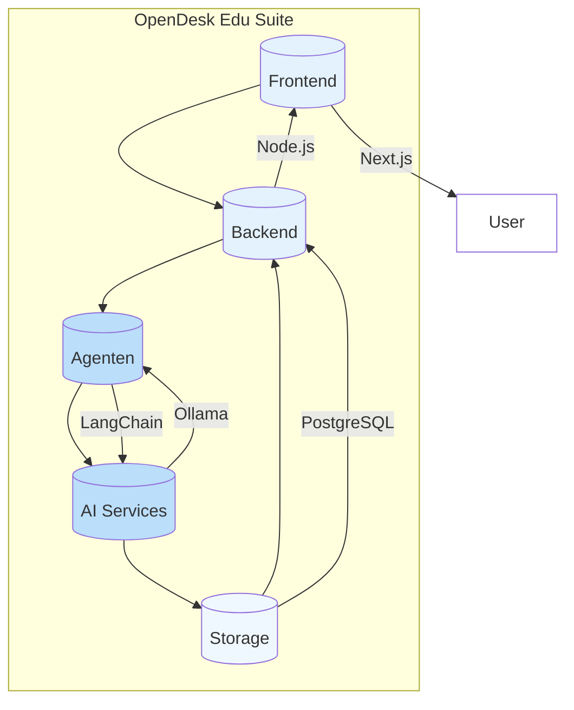
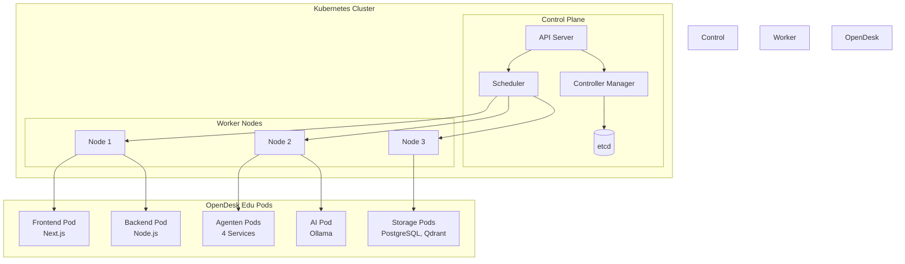
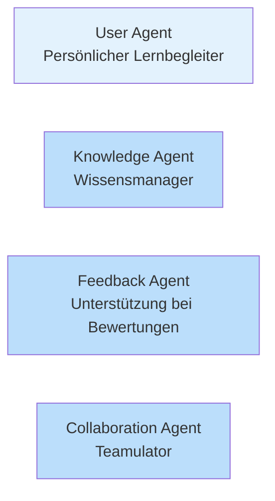
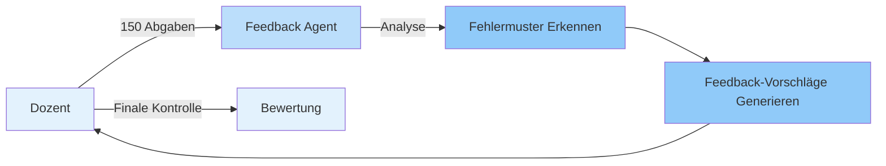
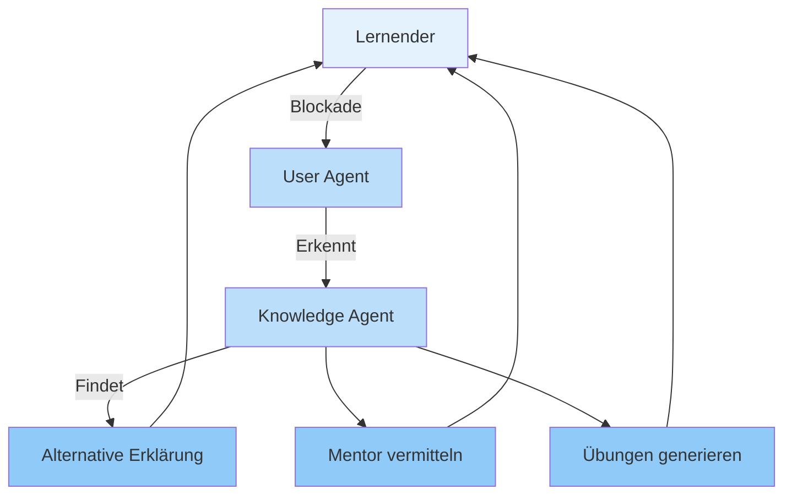
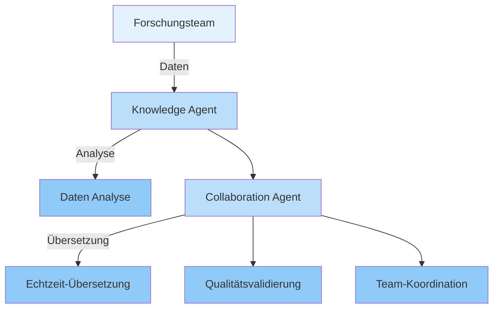
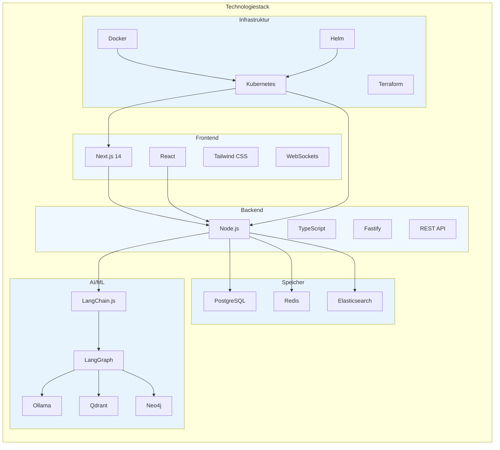
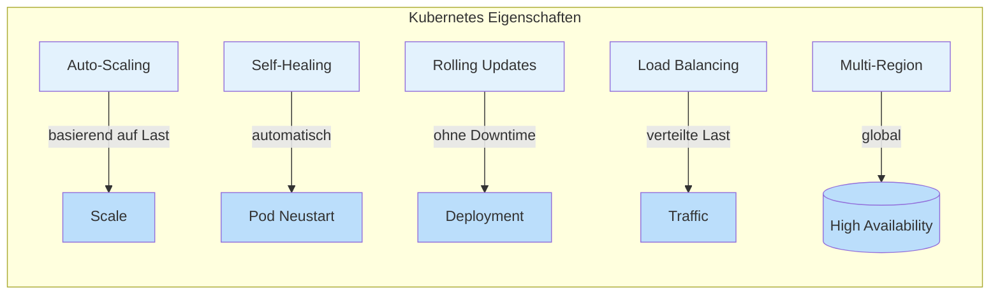

<!-- Slide 1 -->

# OpenDesk Edu

## Agentic Engineering in der Praxis

**Tobias Weiss**

tobias-weiss.org | opendesk-edu.org

*Im Anschluss an Christian Uhl*

HackyHour Gießen | 26.08.2026 | 12+8 Format

---

<!-- Slide 2 -->

# Das Konzept

## Einfach. Mächtig. Offene Architektur.

"Do one thing and do it well" – UNIX Philosophie

Kubernetes-basierte Agenten-Plattform

- **Einfach:** Jeder Agent hat eine Aufgabe
- **Mächtig:** Zusammen lösen sie komplexe Probleme
- **Offen:** 100% Open Source, Self-Hosted

Golden Ratio Design

- **φ ≈ 1.618:** Natürliche Proportionen
- **Minimal:** Keine unnötigen Elemente
- **Stoic:** Funktion über Form

---

<!-- Slide 3 -->

# Die Architektur

**Ein System. Eine Verantwortung. Maximale Flexibilität.**

---

<!-- Slide 4 -->

# Die Kubernetes-Infrastruktur

**Skalierbar. Robust. Enterprise-Ready.**

---

<!-- Slide 5 -->

# Die Agenten

**Jeder Agent hat eine klare Aufgabe:**

✅ **User Agent:** Trackt Fortschritt, erkennt Blockaden, empfiehlt next steps

✅ **Knowledge Agent:** Strukturiert Inhalte, erstellt Zusammenhänge, beantwortet Fragen

✅ **Feedback Agent:** Analysiert Abgaben, generiert Vorschläge, **Mensch entscheidet final**

✅ **Collaboration Agent:** Übersetzt Echtzeit, organisiert Projekte, vermittelt Mentoren

---

<!-- Slide 6 -->

# Das Problem

### Dozent
150 Abgaben × 4 Minuten = **10 Stunden pro Woche**

### Lernender
3 Stunden Frust bei einfachen Konzepten

### Forschungsteam
4 Monate Koordination statt 2 Wochen Analyse

"Just because it's simple doesn't mean it's not powerful"

---

<!-- Slide 7 -->

# Use Case 1

## Korrektur-Unterstützung

**Resultat:** 9 Stunden gespart pro Woche

---

<!-- Slide 8 -->

# Use Case 2

## Adaptives Lernen

**Resultat:** 85% schnelleres Verständnis

---

<!-- Slide 9 -->

# Use Case 3

## Kollaborative Forschung

**Resultat:** 300% schnellere Projektabwicklung

---

<!-- Slide 10 -->

# Die Zahlen

| Metrik | Verbesserung |
|--------|--------------|
| Korrekturzeit | -90% |
| Lernverständnis | +85% |
| Projekt-Durchlauf | +300% |
| Sprachbarrieren | 0% |

"Less is more"

---

<!-- Slide 11 -->

# Die Technologie

**Small, sharp tools.**

---

<!-- Slide 12 -->

# Kubernetes Features

**Skalierbar. Robust. Enterprise-Ready.**

---

<!-- Slide 13 -->

# Jetzt mitmachen

 
GitHub: github.com/opendesk-edu 
Discord: discord.gg/opendesk 
Website: opendesk-edu.org 
 
Docker Compose: docker compose up -d 
Kubernetes: kubectl apply -f manifests/ 
 
Open Source. Self-Hosted. Datenschutzkonform.

---

# 🗳️

## Jetzt abstimmen

 
open-source-wettbewerb.de/voting/opendesk-edu/
 
 
 
QR-Code:
 
 

---

# Fragen

## +8 Minuten

**Technisch:**
- Kubernetes Deployment
- Skalierbarkeit
- Modell-Integration

**Rechtlich:**
- EU AI Act Compliance
- Assisted vs. Automated

**Philosophisch:**
- UNIX Philosophie
- Agentic Engineering
- Minimalismus

"The plain style is the most universal and the most timeless"

---

# Stop thinking

## Start building

"Talk is cheap. Show me the code." – Linus Torvalds

 
 
 
 

OpenDesk Edu – Kubernetes-native Agentic Learning Platform

